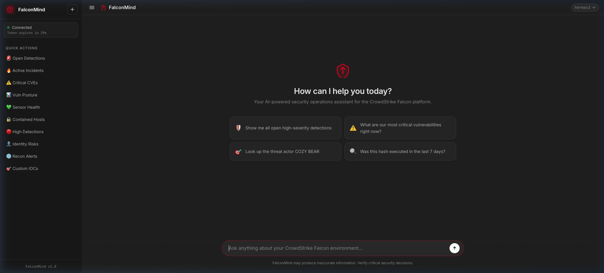

# 🛡️ FalconMind

<div align="center">

**AI-powered security operations chatbot for the CrowdStrike Falcon platform**

[](https://nodejs.org/)
[](https://expressjs.com/)
[](https://www.crowdstrike.com/)
[](https://opensource.org/licenses/MIT)

*Ask questions in plain English — FalconMind translates them into real-time CrowdStrike Falcon API calls.*

</div>

---



---

## 📖 Table of Contents

- [What Is FalconMind?](#-what-is-falconmind)
- [Key Features](#-key-features)
- [Architecture](#️-architecture)
- [How It Works](#-how-it-works)
- [Quick Start](#-quick-start)
- [AI Providers](#-ai-providers)
- [CrowdStrike API Coverage](#-crowdstrike-api-coverage)
- [Required API Scopes](#-required-crowdstrike-api-scopes)
- [Security Considerations](#-security-considerations)
- [Project Structure](#-project-structure)
- [Testing](#-testing)
- [Contributing](#-contributing)
- [License](#-license)

---

## 🔍 What Is FalconMind?

FalconMind is a **self-hosted** web application that lets security analysts, SOC operators, and threat hunters interact with their **CrowdStrike Falcon** tenant using **natural language**. Instead of memorizing API endpoints, writing FQL (Falcon Query Language) filters, or navigating multiple Falcon console pages, analysts can simply type questions in plain English.

Under the hood, FalconMind uses an AI model (your choice of local or cloud-based) with **function calling** to interpret the analyst's intent, select the appropriate CrowdStrike API(s), construct the correct request, and format the response in a human-readable way — all in seconds.

### Example Conversations

| You Ask | FalconMind Does |
|---|---|
| *"Show me all critical detections from today"* | Queries Alerts v2 → filters by `max_severity_displayname:'Critical'` + today's timestamp → returns formatted table |
| *"Was hash `abc123...` seen on any endpoints?"* | Runs indicator hunt across all endpoints via Alerts API → returns matching hosts |
| *"Contain the host WORKSTATION-42"* | Looks up host ID → shows confirmation prompt → performs network containment on approval |
| *"What CVEs affect our Windows servers?"* | Queries Spotlight Vulnerabilities → filters by OS → returns CVE list with CVSS scores |
| *"Tell me about COZY BEAR"* | Queries Falcon Intelligence → returns full adversary profile, motivations, and TTPs |
| *"Show identity-based risk detections"* | Queries Identity Protection API → returns identity risk events |
| *"Create an IOC for this malicious domain"* | Builds IOC payload → shows confirmation → creates custom indicator |
| *"Check sensor health across the fleet"* | Queries Host API → summarizes online/offline/stale sensor counts |
| *"Run a RTR session on the compromised host"* | Initiates Real-Time Response session with confirmation safeguard |
| *"Trigger the incident response workflow"* | Calls Falcon Fusion SOAR → triggers the specified automation workflow |

---

## ✨ Key Features

### 🗣️ Natural Language Interface
- Ask questions in plain English — no FQL, no API knowledge needed
- Context-aware follow-up questions within the same conversation
- Automatic intent detection routes queries to the right CrowdStrike API

### 🤖 Multi-Provider AI Backend
- **Ollama** (recommended) — free, fully local, zero data leaves your machine
- **Groq** — fast cloud inference with generous free tier
- **Google Gemini** — free tier with strong function-calling support
- **OpenAI** — GPT-4o-mini and other models
- Hot-swap models from the UI without restarting

### 🛡️ Comprehensive Falcon Coverage
- **12+ CrowdStrike API modules** — Detections, Incidents, Hosts, Intel, Spotlight, RTR, IOCs, Identity Protection, Firewall, Discover, Recon, SOAR Workflows
- Automatic OAuth2 token management with smart refresh

### 🔒 Security-First Design
- All API keys and tokens stay **server-side only** — nothing reaches the browser
- Destructive actions require **explicit confirmation** before execution
- Rate limiting on all endpoints
- Session management with secure cookies

### 🎨 Modern Dark Theme UI
- Professional dark theme with glassmorphism effects
- Full Markdown rendering with syntax highlighting in responses
- Quick action buttons for common operations
- Real-time server status indicator

---

## 🏗️ Architecture

```
                          ┌─────────────────────────────────────┐
                          │         Browser (Chat UI)           │
                          │  ┌───────────────────────────────┐  │
                          │  │ • Dark theme interface        │  │
                          │  │ • Markdown rendering          │  │
                          │  │ • Quick action sidebar        │  │
                          │  │ • Model selector dropdown     │  │
                          │  │ • Confirmation dialogs        │  │
                          │  └──────────────┬────────────────┘  │
                          └─────────────────┼───────────────────┘
                                            │  HTTP / REST
                                            │  (localhost:3000)
                          ┌─────────────────▼───────────────────┐
                          │         Express.js Server            │
                          │  ┌───────────────────────────────┐  │
                          │  │ Middleware Pipeline:           │  │
                          │  │  → CORS                       │  │
                          │  │  → Body parser (2MB limit)    │  │
                          │  │  → Morgan request logging     │  │
                          │  │  → Session (SQLite-backed)    │  │
                          │  │  → Rate limiter (30 req/min)  │  │
                          │  └──────────────┬────────────────┘  │
                          │  ┌──────────────▼────────────────┐  │
                          │  │ Route Layer:                   │  │
                          │  │  POST /api/chat   (main chat) │  │
                          │  │  POST /api/confirm (actions)  │  │
                          │  │  GET  /api/status  (health)   │  │
                          │  │  GET  /api/models  (list)     │  │
                          │  │  POST /api/models  (switch)   │  │
                          │  └──────────────┬────────────────┘  │
                          └─────────────────┼───────────────────┘
                                            │
                  ┌─────────────────────────┼─────────────────────────┐
                  │                         │                         │
     ┌────────────▼──────────┐  ┌───────────▼──────────┐  ┌──────────▼──────────┐
     │   Intent Router       │  │  Confirmation Store  │  │  Response Formatter │
     │  ┌──────────────────┐ │  │  • Pending actions   │  │  • Markdown tables  │
     │  │ Classifies user  │ │  │  • TTL-based expiry  │  │  • Code blocks      │
     │  │ intent and maps  │ │  │  • Safety gate for   │  │  • Severity colors  │
     │  │ to CrowdStrike   │ │  │    destructive ops   │  │  • Summary cards    │
     │  │ API functions     │ │  └──────────────────────┘  └─────────────────────┘
     │  └──────────────────┘ │
     └───────────┬───────────┘
                 │
     ┌───────────▼───────────────────────────────────────────────────────────────┐
     │                        AI Provider Layer                                  │
     │                                                                           │
     │   ┌──────────┐   ┌──────────┐   ┌──────────┐   ┌──────────┐             │
     │   │  Ollama   │   │   Groq   │   │  Gemini  │   │  OpenAI  │             │
     │   │  (local)  │   │  (cloud) │   │  (cloud) │   │  (cloud) │             │
     │   └─────┬─────┘   └─────┬────┘   └─────┬────┘   └─────┬────┘             │
     │         └───────────────┴───────────────┴───────────────┘                 │
     │                              │                                            │
     │              Function calling / Tool use                                  │
     │              (30+ CrowdStrike functions defined)                          │
     └──────────────────────────────┬────────────────────────────────────────────┘
                                    │
     ┌──────────────────────────────▼────────────────────────────────────────────┐
     │                  CrowdStrike Service Layer                                │
     │                                                                           │
     │   ┌────────────┐  ┌──────────┐  ┌──────────┐  ┌──────────────────────┐   │
     │   │ auth.js    │  │ hosts.js │  │ intel.js │  │ threatHunting.js     │   │
     │   │ OAuth2     │  │ endpoint │  │ adversary│  │ behaviors, IOC hunts │   │
     │   │ token mgr  │  │ queries  │  │ profiles │  │ with FQL sanitizer   │   │
     │   ├────────────┤  ├──────────┤  ├──────────┤  ├──────────────────────┤   │
     │   │ client.js  │  │ iocs.js  │  │ recon.js │  │ detections.js       │   │
     │   │ axios HTTP │  │ custom   │  │ digital  │  │ alerts v2, severity  │   │
     │   │ wrapper    │  │ IOCs     │  │ risk     │  │ filtering            │   │
     │   ├────────────┤  ├──────────┤  ├──────────┤  ├──────────────────────┤   │
     │   │ rtr.js     │  │ siem.js  │  │ soar.js  │  │ spotlight.js        │   │
     │   │ real-time  │  │ event    │  │ workflow │  │ vulnerability        │   │
     │   │ response   │  │ streams  │  │ triggers │  │ management           │   │
     │   ├────────────┤  ├──────────┤  ├──────────┤  ├──────────────────────┤   │
     │   │ identity.js│  │firewall.js│ │discover.js│ │ fqlSanitizer.js     │   │
     │   │ IDP alerts │  │ FW rules │  │ shadow IT│  │ safe filter builder  │   │
     │   └────────────┘  └──────────┘  └──────────┘  └──────────────────────┘   │
     │                                                                           │
     └──────────────────────────────┬────────────────────────────────────────────┘
                                    │  OAuth2 Bearer Token
                                    │  (auto-refreshed, in-memory only)
                          ┌─────────▼─────────┐
                          │  CrowdStrike      │
                          │  Falcon Cloud API │
                          │  (api.crowdstrike │
                          │   .com)           │
                          └───────────────────┘
```

### Design Principles

| Principle | How It's Implemented |
|---|---|
| **Server-side only** | All API keys, OAuth tokens, and AI calls stay on the Express server — the browser never sees them |
| **Safety gates** | Destructive ops (containment, IOC creation, RTR, workflows) require explicit confirmation before execution |
| **FQL sanitization** | User inputs are validated and sanitized before building Falcon Query Language filters |
| **Graceful degradation** | If a CrowdStrike API returns an error (400/403/429), the response is mapped to a friendly message instead of crashing |
| **Stateless AI** | Each message is self-contained with full system context — the AI doesn't maintain implicit session state |

---

## ⚙️ How It Works

1. **User sends a message** → The browser `POST`s to `/api/chat` with the user's text
2. **Intent classification** → The server's intent router analyzes the query and builds a system prompt tailored to the relevant CrowdStrike domain
3. **AI function calling** → The AI model receives the query + 30+ available CrowdStrike tool definitions. It decides which function(s) to call and with what parameters
4. **CrowdStrike API execution** → The selected function calls the appropriate Falcon API endpoint with proper OAuth2 authentication
5. **Response formatting** → The raw API data is formatted into Markdown tables, severity-colored badges, and human-readable summaries
6. **Safety check** → If the AI chose a destructive action (containment, IOC creation, etc.), a confirmation prompt is shown instead of executing immediately
7. **Response delivery** → The formatted response is returned to the browser and rendered with full Markdown support

---

## 🚀 Quick Start

### Prerequisites

| Requirement | Minimum | Notes |
|---|---|---|
| **Node.js** | 18.0+ | [Download](https://nodejs.org/) |
| **npm** | 9.0+ | Bundled with Node.js |
| **CrowdStrike Falcon** | API client | [Create one →](#-required-crowdstrike-api-scopes) |
| **AI Provider** | One of below | At least one required |

**AI Provider Options:**
- 🟢 [Ollama](https://ollama.ai/) — **Recommended.** Free, runs locally, no data leaves your network
- 🟡 [Groq](https://console.groq.com/keys) — Free tier (250 req/day), ultra-fast inference
- 🟡 [Google Gemini](https://aistudio.google.com/app/apikey) — Free tier, good function-calling
- 🔴 [OpenAI](https://platform.openai.com/api-keys) — Paid, GPT-4o-mini recommended

### Installation

```bash
# 1. Clone the repository
git clone https://github.com/parag-samant/FalconMind-Chatbot.git
cd FalconMind-Chatbot

# 2. Install dependencies
npm install

# 3. Configure environment
cp .env.example .env
# Edit .env with your credentials (see table below)

# 4. Start the server
npm start
```

Open **http://localhost:3000** in your browser — you're ready to go! 🚀

### Environment Variables

Edit your `.env` file with the following values:

| Variable | Required | Default | Description |
|---|---|---|---|
| `AI_PROVIDER` | ✅ | `ollama` | AI backend: `ollama`, `groq`, `gemini`, or `openai` |
| `CS_CLIENT_ID` | ✅ | — | CrowdStrike API client ID |
| `CS_CLIENT_SECRET` | ✅ | — | CrowdStrike API client secret |
| `CS_BASE_URL` | ✅ | `https://api.crowdstrike.com` | Your Falcon cloud region URL |
| `SESSION_SECRET` | ✅ | — | Random string for session encryption |
| `OLLAMA_MODEL` | If using Ollama | `hermes3:latest` | Ollama model to use |
| `OLLAMA_BASE_URL` | If using Ollama | `http://localhost:11435/v1` | Ollama server URL |
| `GROQ_API_KEY` | If using Groq | — | Groq API key |
| `GEMINI_API_KEY` | If using Gemini | — | Google Gemini API key |
| `OPENAI_API_KEY` | If using OpenAI | — | OpenAI API key |
| `PORT` | No | `3000` | Server port |
| `NODE_ENV` | No | `development` | `development` or `production` |
| `RATE_LIMIT_MAX` | No | `30` | Max requests per minute |
| `LOG_LEVEL` | No | `info` | Logging level |

> 💡 **Generate a session secret:**
> ```bash
> node -e "console.log(require('crypto').randomBytes(64).toString('hex'))"
> ```

### CrowdStrike Region URLs

| Region | Base URL |
|---|---|
| US-1 | `https://api.crowdstrike.com` |
| US-2 | `https://api.us-2.crowdstrike.com` |
| EU-1 | `https://api.eu-1.crowdstrike.com` |
| US-GOV-1 | `https://api.laggar.gcw.crowdstrike.com` |

### Setting Up Ollama (Recommended)

Ollama lets you run AI models **100% locally** — no API keys needed, no data leaves your machine:

```bash
# Start Ollama via Docker
docker run -d --name ollama -p 11435:11434 ollama/ollama:latest

# Pull the recommended model (3.4GB download)
docker exec ollama ollama pull hermes3:latest

# Verify it's running
curl http://localhost:11435/v1/models
```

Then set in your `.env`:
```env
AI_PROVIDER=ollama
OLLAMA_MODEL=hermes3:latest
OLLAMA_BASE_URL=http://localhost:11435/v1
OLLAMA_ENABLE_TOOLS=true
```

---

## 🤖 AI Providers

Switch providers at any time by changing `AI_PROVIDER` in `.env`, or use the **model selector dropdown** in the UI:

| Provider | Setting | Speed | Cost | Privacy | Function Calling |
|----------|---------|-------|------|---------|-----------------|
| **Ollama** ⭐ | `ollama` | 4–60s | Free | 🟢 100% local | ✅ (model-dependent) |
| **Groq** | `groq` | 1–3s | Free tier (250 RPD) | 🟡 Cloud | ✅ Compound models |
| **Gemini** | `gemini` | 2–5s | Free tier | 🟡 Cloud | ✅ Native |
| **OpenAI** | `openai` | 2–5s | Paid (~$0.002/query) | 🟡 Cloud | ✅ Native |

> **Recommendation:** Start with **Ollama** for privacy and zero cost. If you need faster responses, use **Groq** (free tier) or **Gemini** (free tier).

---

## 🛡️ CrowdStrike API Coverage

FalconMind provides coverage across **12+ CrowdStrike Falcon API modules**:

| Module | Service File | Capabilities |
|---|---|---|
| **Detections & Alerts** | `detections.js` | List, filter by severity/date/host, update status, assign to analysts |
| **Incidents** | `threatHunting.js` | List incidents, search behaviors, investigate TTPs |
| **Threat Hunting** | `threatHunting.js` | Hash hunts, IOC hunts, behavior searches with FQL sanitization |
| **Falcon Intelligence** | `intel.js` | Threat actor profiles, intel reports, indicator enrichment |
| **Host Management** | `hosts.js` | List endpoints, get details, network contain/uncontain hosts |
| **Spotlight Vulnerabilities** | `spotlight.js` | Query vulnerabilities, CVE lookups, host exposure assessment |
| **Real-Time Response** | `rtr.js` | Initiate RTR sessions for live forensics |
| **Custom IOCs** | `iocs.js` | List, create, update, and delete custom indicators of compromise |
| **Identity Protection** | `identity.js` | Identity-based risk scores and detection alerts |
| **Firewall Management** | `firewall.js` | Query firewall rules and policies |
| **Exposure Management** | `discover.js` | Discover unmanaged assets, shadow IT, IoT devices |
| **Recon** | `recon.js` | Dark web and digital risk monitoring |
| **SOAR / Workflows** | `soar.js` | Trigger Falcon Fusion automation workflows |
| **SIEM** | `siem.js` | Event stream queries and log data |

---

## 📋 Required CrowdStrike API Scopes

Create an API client at **Falcon Console → Support and resources → API Clients and Keys** with these scopes:

| Scope | Read | Write | Purpose |
|---|---|---|---|
| **Detections** | ✅ | ✅ | Query and update detection statuses |
| **Incidents** | ✅ | ✅ | View and manage security incidents |
| **Hosts** | ✅ | ✅ | Query endpoints, perform containment |
| **Spotlight Vulnerabilities** | ✅ | — | Vulnerability and CVE data |
| **Threat Intelligence** | ✅ | — | Adversary profiles and intel reports |
| **Real-Time Response** | ✅ | ✅ | Live forensics and response sessions |
| **IOC Manager** | ✅ | ✅ | Manage custom indicators |
| **Identity Protection** | ✅ | — | Identity-based threat detections |
| **Firewall Management** | ✅ | — | Firewall rule queries |
| **Discover** | ✅ | — | Asset and shadow IT discovery |
| **Recon** | ✅ | — | Digital risk monitoring |
| **Workflows** | ✅ | ✅ | SOAR automation triggers |

> ⚠️ **Principle of Least Privilege:** Only grant Write access to scopes you actually need. If you only want read-only analysis, remove Write from Detections, Incidents, Hosts, RTR, IOC Manager, and Workflows.

---

## 🔐 Security Considerations

### Credential Safety
- ✅ **All API keys stay server-side** — CrowdStrike credentials, AI provider keys, and OAuth tokens are never sent to the browser
- ✅ **OAuth2 tokens are in-memory only** — never written to disk, never sent to the client
- ✅ `.env` is in `.gitignore` — credentials are never committed to version control
- ✅ `.env.example` contains only empty placeholders — safe to share publicly

### Operational Safety  
- ✅ **Destructive action confirmation** — containment, IOC creation, RTR sessions, and workflow triggers require explicit approval before execution
- ✅ **FQL sanitization** — user inputs are validated and sanitized before being used in Falcon Query Language filters, preventing injection
- ✅ **Rate limiting** — 30 requests/min on chat, 10 requests/min on destructive actions
- ✅ **Secure sessions** — HTTPOnly cookies with SameSite=strict, session secrets generated with 64 bytes of crypto-random data

### Deployment Safety
- ✅ **No credentials in code** — all secrets come from environment variables or platform-level secret managers
- ✅ For cloud deployment (Heroku, Railway, Render, etc.), set secrets as **platform environment variables** — never commit them
- ✅ For GitHub Actions CI/CD, use **Repository Secrets** (`Settings → Secrets → Actions`)

---

## 📁 Project Structure

```
FalconMind-Chatbot/
│
├── server.js                    # Express app entry point
├── config/
│   └── index.js                 # Environment variable loader + validation
│
├── middleware/
│   ├── errorHandler.js          # Global error handler (chat-safe responses)
│   ├── rateLimiter.js           # Rate limiting (standard + destructive)
│   ├── requestLogger.js         # Morgan HTTP logging (strips sensitive headers)
│   └── session.js               # SQLite-backed session management
│
├── routes/
│   ├── chat.js                  # POST /api/chat — main AI conversation
│   ├── confirm.js               # POST /api/confirm — destructive action approval
│   ├── models.js                # GET/POST /api/models — list/switch AI models
│   ├── quickActions.js          # GET /api/quick-actions — sidebar presets
│   └── status.js                # GET /api/status — health check
│
├── services/
│   ├── ai/
│   │   ├── factory.js           # AI provider factory (selects Ollama/Groq/Gemini/OpenAI)
│   │   └── systemPrompt.js      # Shared system prompt with security context
│   │
│   ├── crowdstrike/
│   │   ├── auth.js              # OAuth2 token lifecycle (auto-refresh)
│   │   ├── client.js            # Axios HTTP client wrapper
│   │   ├── detections.js        # Alerts/Detections API v2
│   │   ├── hosts.js             # Host management + containment
│   │   ├── intel.js             # Falcon Intelligence (actors, reports)
│   │   ├── threatHunting.js     # Incident behaviors + IOC hunting
│   │   ├── spotlight.js         # Vulnerability management
│   │   ├── rtr.js               # Real-Time Response sessions
│   │   ├── iocs.js              # Custom IOC management
│   │   ├── identity.js          # Identity Protection API
│   │   ├── firewall.js          # Firewall Management API
│   │   ├── discover.js          # Exposure Management / Discover API
│   │   ├── recon.js             # Digital risk monitoring
│   │   ├── siem.js              # SIEM event streams
│   │   └── soar.js              # Falcon Fusion workflow triggers
│   │
│   ├── gemini/                  # Google Gemini AI provider
│   ├── groq/                    # Groq AI provider
│   ├── ollama/                  # Ollama (local) AI provider
│   └── openai/                  # OpenAI provider + function definitions (30+)
│
├── utils/
│   ├── intentRouter.js          # Intent classification → function mapping
│   ├── fqlSanitizer.js          # FQL filter validation and sanitization
│   ├── responseFormatter.js     # Markdown response builder
│   ├── confirmationStore.js     # Pending action store (TTL-based)
│   └── summarizationPrompt.js   # AI-powered result summarization
│
├── tests/                       # Jest test suite
│   ├── services/                # AI provider + system prompt tests
│   └── utils/                   # Utility function tests
│
├── public/                      # Frontend (static files)
│   ├── index.html               # Main chat interface
│   ├── css/style.css            # Dark theme with glassmorphism
│   └── js/
│       ├── app.js               # Chat logic + message handling
│       ├── modelSelector.js     # AI model dropdown
│       ├── quickActions.js      # Quick action buttons
│       ├── markdown.js          # Markdown rendering
│       ├── status.js            # Server health polling
│       └── avatars.js           # User/bot avatar generation
│
├── docs/
│   └── homepage.png             # Application screenshot
├── .env.example                 # Environment variable template (safe to commit)
├── .gitignore                   # Excludes .env, node_modules, sessions.db, etc.
├── package.json                 # Dependencies and scripts
└── package-lock.json            # Locked dependency versions
```

---

## 🧪 Testing

```bash
# Run all tests
npm test

# Run with coverage report
npm run test:coverage

# Development mode (auto-restart on changes)
npm run dev
```

---

## 🤝 Contributing

Contributions are welcome! Please:

1. Fork the repository
2. Create a feature branch (`git checkout -b feature/amazing-feature`)
3. Commit your changes (`git commit -m 'Add amazing feature'`)
4. Push to the branch (`git push origin feature/amazing-feature`)
5. Open a Pull Request

> **Important:** Never commit API keys or credentials. Use environment variables for all secrets.

---

## 📝 License

This project is licensed under the **MIT License** — see the [LICENSE](LICENSE) file for details.

---

## 🙏 Acknowledgements

- [CrowdStrike Falcon](https://www.crowdstrike.com/) — Endpoint security and threat intelligence platform
- [Ollama](https://ollama.ai/) — Local LLM runtime
- [Groq](https://groq.com/) — Ultra-fast AI inference
- [Google Gemini](https://ai.google.dev/) — Multimodal AI platform
- [OpenAI](https://openai.com/) — GPT model family
- [Express.js](https://expressjs.com/) — Fast, unopinionated web framework
- [Axios](https://axios-http.com/) — Promise-based HTTP client

---

<div align="center">

*Built with ❤️ for security analysts who'd rather ask questions than write FQL.*

**[⬆ Back to top](#️-falconmind)**

</div>
